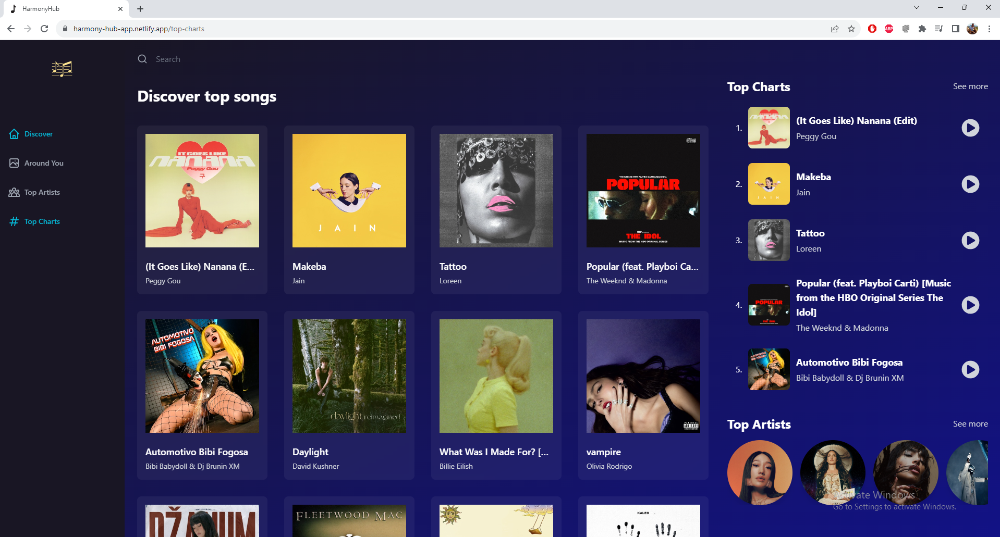
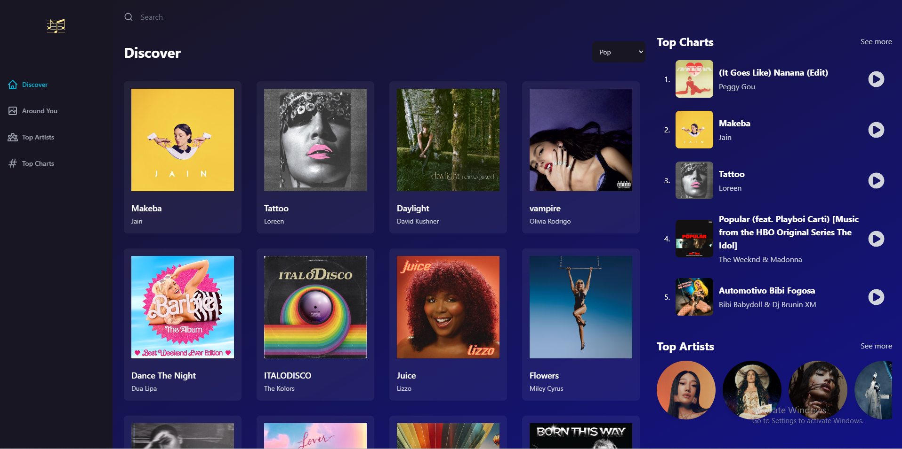
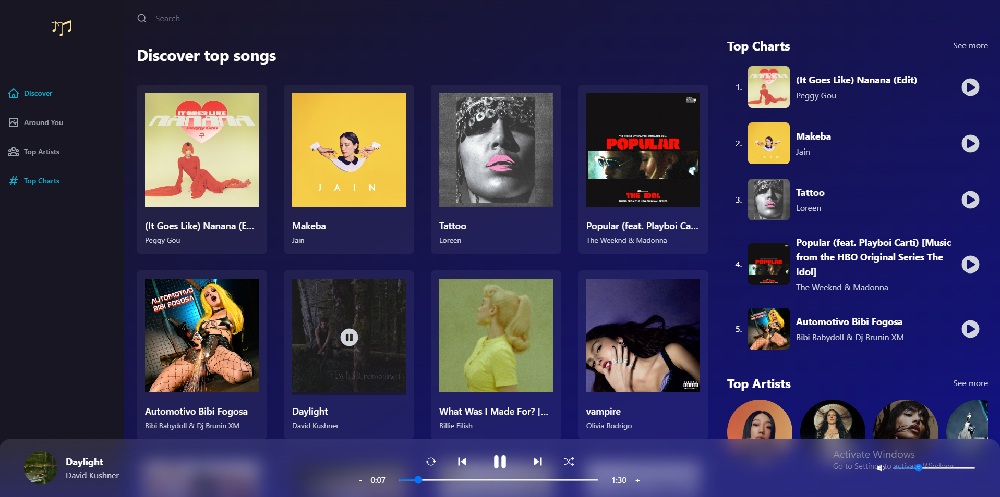
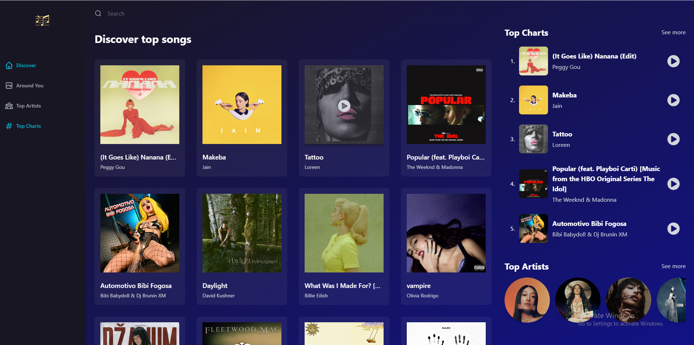
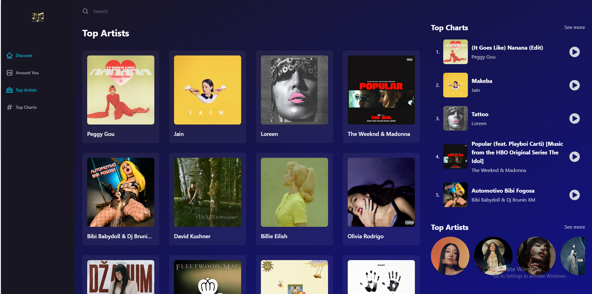
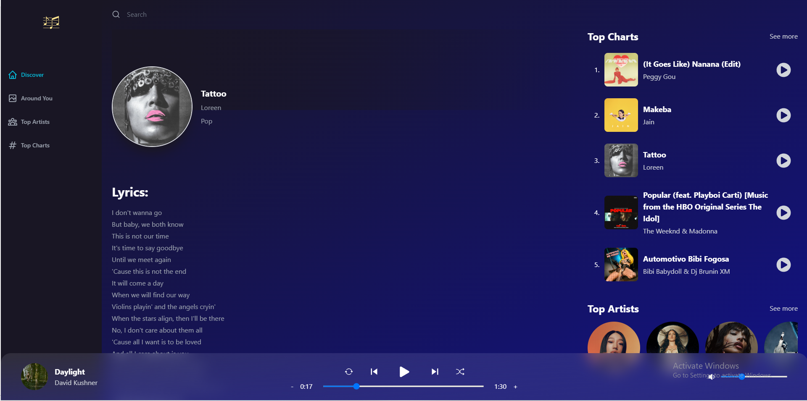
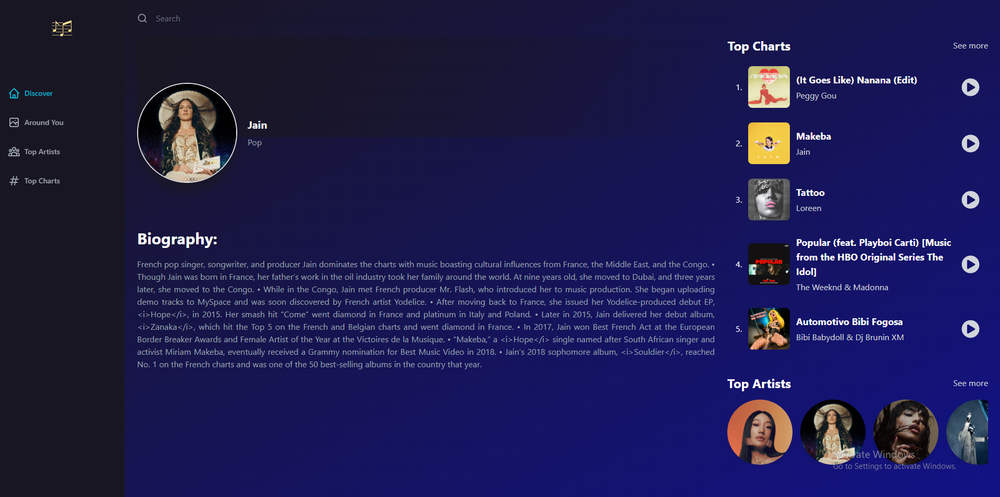
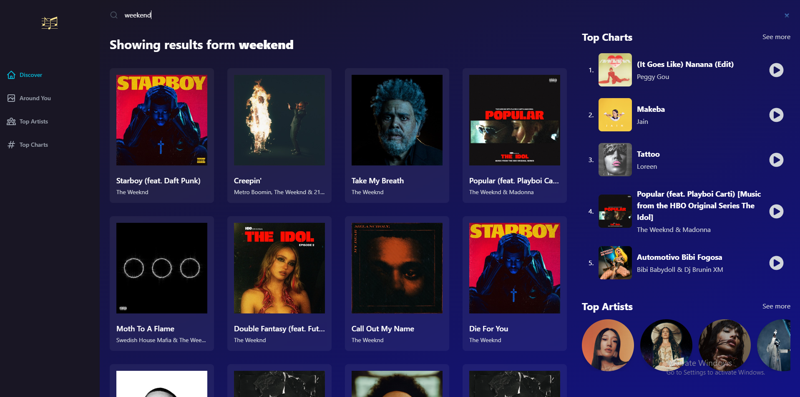

<!-- Improved compatibility of back to top link: See: https://github.com/othneildrew/Best-README-Template/pull/73 -->
<a name="readme-top"></a>

<!-- PROJECT LOGO -->
<br />
<div align="center">
  <a href="https://harmony-hub-app.netlify.app/">
    
  </a>

  <h3 align="center">Harmony hub</h3>

  <p align="center">
    Web application for music
    <br />
    <a href="https://github.com/mkulovac1/HarmonyHub"><strong>Explore the docs »</strong></a>
    <br />
    <br />
    <a href="https://drive.google.com/file/d/1w4oZLbMxuHCoJA3re9zMnkJu0wskWtAe/view">View Demo</a>
    ·
    <a href="https://github.com/mkulovac1/HarmonyHub/issues">Report Bug</a>
  </p>
</div>

<!-- ABOUT THE PROJECT -->
## About The Project

<a href="https://harmony-hub-app.netlify.app/">
  
</a>

The Harmony hub application is a web application primarily used for listening to music. Through this application, you can also see which songs are currently the most popular or which singers are currently the most popular. You can choose a specific genre of music. You can also search for a specific song or singer through the search engine. For each singer, it is possible to see biography and the songs he/she owns. Also, you can see the lyrics for each song. You can choose to see only songs from your country, too.

<p align="right">(<a href="#readme-top">back to top</a>)</p>


## Demo

You can see a demo of this application on the following link: [CLICK ME](https://drive.google.com/file/d/1w4oZLbMxuHCoJA3re9zMnkJu0wskWtAe/view)
<p align="right">(<a href="#readme-top">back to top</a>)</p>


## Deployment
You can see this project deployed on the link: [CLICK ME](https://harmony-hub-app.netlify.app/)

<p align="right">(<a href="#readme-top">back to top</a>)</p>


## Built With

* React
* Tailwind CSS
* Rapid API

<p align="right">(<a href="#readme-top">back to top</a>)</p>


<!-- GETTING STARTED -->
## Getting Started

To run this project locally you need to do following (prerequisites and installation).

### Prerequisites

* Visual studio code
* Node.js
* npm

### Installation

1. Clone the repo
   ```sh
   git clone https://github.com/mkulovac1/HarmonyHub
   ```
2. Open this project in Visual studio code
3. Type this command in terminal
   ```sh
   cd app
   ```
4. Install NPM packages through terminal
   ```sh
   npm install
   ```
5. Run application through terminal
   ```js
   npm run dev
   ```

<p align="right">(<a href="#readme-top">back to top</a>)</p>


<!-- USAGE EXAMPLES -->
## Usage

Here you can see examples of using app.

Discovery (main) page:

<a href="https://harmony-hub-app.netlify.app/">
  
</a>

Music player:

<a href="https://harmony-hub-app.netlify.app/">
  
</a>

Top songs:

<a href="https://harmony-hub-app.netlify.app/">
  
</a>

Top artists:

<a href="https://harmony-hub-app.netlify.app/">
  
</a>

Song details:

<a href="https://harmony-hub-app.netlify.app/">
  
</a>

Artist details:

<a href="https://harmony-hub-app.netlify.app/">
  
</a>

Searching:

<a href="https://harmony-hub-app.netlify.app/">
  
</a>


_For more examples, please refer to the [Documentation](https://example.com)_

<p align="right">(<a href="#readme-top">back to top</a>)</p>


<!-- CONTRIBUTING -->
## Contributing

Contributions are what make the open source community such an amazing place to learn, inspire, and create. Any contributions you make are **greatly appreciated**.

If you have a suggestion that would make this better, please fork the repo and create a pull request. You can also simply open an issue with the tag "enhancement".
Don't forget to give the project a star! Thanks again!

1. Fork the Project
2. Create your Feature Branch (`git checkout -b feature/AmazingFeature`)
3. Commit your Changes (`git commit -m 'Add some AmazingFeature'`)
4. Push to the Branch (`git push origin feature/AmazingFeature`)
5. Open a Pull Request

<p align="right">(<a href="#readme-top">back to top</a>)</p>


<!-- CONTACT -->
## Contact

Merim Kulovac, [@merimkulovac](https://www.linkedin.com/in/merimkulovac/), e-mail: merim.kulovac@outlook.com

<p align="right">(<a href="#readme-top">back to top</a>)</p>
